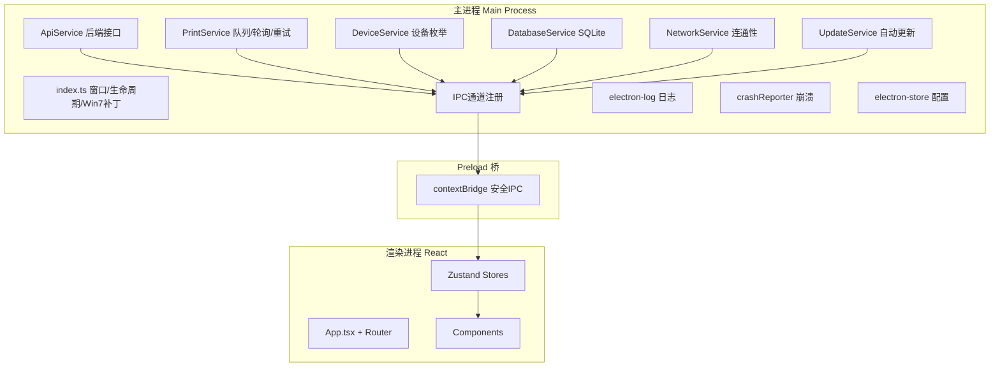

## 产品概述

比优特到家小票打印系统 Electron 版桌面应用，将现有 KMP（Compose Desktop）版本完整迁移至 Electron 平台。面向到店工作人员，自动轮询外卖平台订单并驱动热敏打印机打印小票。必须兼容 Windows 7 操作系统。

## 核心功能

- **启动检查**：Splash 启动页检查服务器版本信息，展示检查状态（检查中/有新版本/正常/异常）
- **门店登录**：输入门店号进入主页，本地持久化记住门店号，下次自动跳过
- **打印设备管理**：枚举系统驱动打印机和串口设备，单选切换当前打印设备，支持刷新
- **平台选择**：从服务器获取外卖平台列表（美团/京东等），多选勾选需监听的平台，支持全选
- **自动轮询打印**：按选中平台每 10 秒轮询新订单，获取订单详情，ESC/POS 热敏打印，打印队列 + 双重去重（已打印 + 打印中）+ 3 次重试
- **SQLite 持久化**：已打印订单表（防重复）+ 待打印订单表（重启恢复）+ 取消订单表，按日期+门店查询
- **小票模板**：订单号大号字→平台名→门店名→用户联→CODE128 条码→订单信息→备注→商品列表→金额汇总→底部提示→客服图片→切纸
- **退款提示**：检测到退款通知播放提示音（6 秒冷却防频繁）
- **网络检查**：定时 HEAD 请求检查服务器连通性，底部状态栏展示
- **崩溃日志**：未捕获异常写日志文件 + 弹窗提示 + 可打开日志目录
- **订单管理**：每个平台卡片显示待打印/已打印订单列表，支持重打、复单（复制订单号）
- **自动更新**（最后实现）：检查版本→下载服务器安装包→覆盖安装→重启升级

## 技术栈选型

### 核心框架（Win7 兼容性铁律）

- **Electron 22.3.27**：最后支持 Win7/8/8.1 的版本（Chromium 108），锁定不可升级
- **electron-builder 24.x**：打包工具，nsis 格式安装包
- **electron-updater 6.x**：自动更新（nsis 全量包，关闭 differentialDownload）
- **Node.js 16.x**（开发环境）：匹配 Electron 22 的 Node ABI

### 渲染进程（UI 层）

- **React 18 + TypeScript**：与 Compose 编程模型一一对应（@Composable→函数组件，remember→useState，LaunchedEffect→useEffect，collectAsState→useSyncExternalStore）
- **MUI v6**：Material Design 组件库，风格与 Compose Material 3 一致
- **Vite 5**：开发构建工具，HMR 热更新
- **React Router 6**：Splash/Login/Home 路由
- **Zustand**：全局状态管理（类似 StateFlow）
- **axios**：HTTP 请求

### 主进程（系统层）

- **better-sqlite3**：SQLite 本地存储（同步 API、高性能），需 electron-rebuild 编译
- **serialport + usb**：打印设备枚举与串口通信
- **node-thermal-printer**：ESC/POS 指令封装
- **electron-store**：轻量配置持久化（门店号、选中打印机、选中平台）
- **bwip-js**：CODE128 条码生成
- **electron-log**：日志文件（分级 + 日期轮转）
- **crashReporter**（Electron 内置）：崩溃 dump

### Win7 兼容性处理

- `app.disableHardwareAcceleration()`：关闭 GPU 硬件加速
- `--disable-gpu --no-sandbox` 启动参数防黑屏
- 服务器确保 TLS 1.2 可用
- 原生模块需 electron-rebuild 针对 Electron 22 ABI 编译
- electron-updater 关闭增量更新，全量 nsis 包覆盖安装
- 内置中文字体兜底

## 实现方案

### 架构设计

主进程-渲染进程分离架构，通过 preload + contextBridge 安全通信：



### 后端接口对接

- 域名：`http://<生产域名>`，前缀 `/index.php/Home/<接口前缀名>/`
- `GET getLastAppVersionData`：版本检查
- `GET getPlatformList`：平台列表
- `POST getDaySeq`（wmid/shopid/secret）：订单号列表
- `POST getOrderList`（wmid/shopid/secret/orderid_list[]）：订单详情列表
- `POST getOrder`（wmid/shopid/day_seq/secret）：单个订单详情
- secret 值：`<鉴权密钥>`

### ESC/POS 打印模板移植

1:1 移植 PrintTemplate.kt + EscPosPrinter.kt：

- ESC @ 初始化，GBK 编码，ESC a 对齐，ESC E 加粗，GS! 字号
- 32 字符宽度分隔线，左右对齐计算字节宽度填充
- CODE128 条码：bwip-js 生成图片 → RasterBitImage 位图指令
- 客服图片：文件读取 → 等比缩放 → 二值化 → 位图指令
- ESC d 走纸，GS V 1 切纸

### SQLite 表结构（与 KMP DatabaseManager.kt 一致）

- `printed_order`：platform_id/order_id/day_seq/date/shop_id，PRIMARY KEY(platform_id, order_id, shop_id)
- `pending_print_order`：同上 + retry_count INTEGER DEFAULT 0
- `cancel_order`：platform_id/day_seq/date/order_id/shop_id，PRIMARY KEY(shop_id, date, order_id)
- 索引：idx_printed_order_shop_date(date, shop_id)、idx_pending_print_order_shop_date(shop_id, date)、idx_cancel_order_index(date, shop_id)

### 日志兜底（与 KMP CrashHandler.kt 一致）

- process.on('uncaughtException') → electron-log 写文件 + 弹窗提示
- crashReporter.start() → 崩溃 dump
- 日志目录：`%APPDATA%/pgprint/logs/`
- 菜单"错误日志"可打开目录（对应原版 onHandleOpenLogFolder）

## 实现要点

1. **原生模块编译**：better-sqlite3/serialport/usb 必须用 electron-rebuild 针对 Electron 22 编译，否则启动崩溃
2. **打印队列线程安全**：内存 Set（printingOrderIds）+ SQLite（printed/pending）双重去重
3. **GBK 编码**：中文文本必须 GBK 编码写入字节流，否则热敏打印机乱码
4. **日志三层防护**：uncaughtException + crashReporter + electron-log
5. **自动更新放最后**：先确保核心功能全部可用

## 目录结构

```
pgprintElectronversion/
├── package.json                      # [NEW] 项目配置（锁定 electron 22.3.27）、依赖、脚本
├── electron-builder.yml              # [NEW] 打包配置（nsis/appId/图标/更新服务器URL）
├── vite.config.ts                    # [NEW] 渲染进程 Vite 构建
├── vite.main.config.ts               # [NEW] 主进程 Vite 构建
├── vite.preload.config.ts           # [NEW] preload Vite 构建
├── tsconfig.json                     # [NEW] TypeScript 配置
├── tsconfig.node.json               # [NEW] 主进程 TS 配置
├── .env                              # [NEW] 开发环境（DOMAIN_URL）
├── .env.production                   # [NEW] 生产环境
├── .gitignore                        # [NEW]
├── CHANGELOG.md                      # [NEW] 变更日志
├── README.md                         # [MODIFY] 更新为 Electron 版说明
├── docs/                             # [NEW] 项目文档
│   ├── 页面功能流程文档.md            # 各页面功能/操作流程/状态流转
│   ├── 接口对接文档.md               # 接口地址/参数/返回/错误码
│   └── 自动更新方案文档.md           # 更新流程/服务器配置/latest.yml
├── resources/                        # [NEW] 静态资源
│   ├── icon.ico                      # 应用图标
│   ├── notice.wav                    # 退款提示音
│   └── fonts/                        # 内置中文字体 Win7 兜底
├── build/                            # [NEW]
│   └── icon.ico
├── src/
│   ├── main/                         # [NEW] 主进程
│   │   ├── index.ts                  # 入口：创建窗口/菜单/生命周期/Win7补丁
│   │   ├── ipc/                      # [NEW] IPC 通道注册
│   │   │   ├── print.ipc.ts         # 打印相关 IPC（队列/单打/测试）
│   │   │   ├── device.ipc.ts         # 设备枚举 IPC
│   │   │   ├── store.ipc.ts          # 配置读写 IPC
│   │   │   └── update.ipc.ts         # 更新相关 IPC
│   │   ├── services/                 # [NEW] 业务逻辑层
│   │   │   ├── ApiService.ts         # axios 封装 + 后端接口
│   │   │   ├── PrintService.ts       # 打印队列/轮询/去重/重试/恢复
│   │   │   ├── DeviceService.ts       # USB/串口/驱动打印机枚举
│   │   │   ├── DatabaseService.ts     # better-sqlite3 封装
│   │   │   ├── NetworkService.ts      # 连通性定时检查
│   │   │   └── UpdateService.ts        # electron-updater 封装
│   │   ├── utils/                    # [NEW] 工具层
│   │   │   ├── escpos.ts             # ESC/POS 指令封装（移植 EscPosPrinter.kt）
│   │   │   ├── printTemplate.ts       # 小票模板（移植 PrintTemplate.kt）
│   │   │   ├── logger.ts             # electron-log 配置
│   │   │   ├── crash.ts              # crashReporter + uncaughtException
│   │   │   ├── version.ts            # 版本比较（移植 Utils.compareVersion）
│   │   │   └── paths.ts             # 数据目录管理（移植 PersistentCache.kt）
│   │   └── config.ts                 # [NEW] 配置常量（域名/版本/密钥/轮询间隔）
│   ├── renderer/                     # [NEW] 渲染进程
│   │   ├── index.html                # [NEW] HTML 入口
│   │   ├── main.tsx                  # [NEW] React 入口
│   │   ├── App.tsx                   # [NEW] 根组件 + 路由
│   │   ├── router/                   # [NEW]
│   │   │   └── index.tsx             # 路由定义 Splash/Login/Home
│   │   ├── stores/                   # [NEW] Zustand
│   │   │   ├── deviceStore.ts        # 打印设备状态
│   │   │   ├── platformStore.ts       # 平台列表/选中
│   │   │   ├── printStore.ts          # 已打印/待打印订单Map
│   │   │   ├── updateStore.ts         # 更新状态
│   │   │   ├── networkStore.ts        # 网络状态
│   │   │   └── configStore.ts        # 门店号等配置
│   │   ├── views/                    # [NEW] 页面
│   │   │   ├── SplashView.tsx        # 检查更新（4状态）
│   │   │   ├── LoginView.tsx         # 门店号输入
│   │   │   └── HomeView.tsx          # 主页
│   │   ├── components/               # [NEW] 通用组件
│   │   │   ├── AppHeader.tsx         # 顶部栏
│   │   │   ├── AppFooter.tsx         # 底部网络状态
│   │   │   ├── DevicePanel.tsx       # 设备选择
│   │   │   ├── PlatformPanel.tsx     # 平台选择
│   │   │   ├── PlatformGrid.tsx     # 平台订单网格
│   │   │   ├── HistoryLog.tsx       # 连接信息
│   │   │   ├── SettingPanel.tsx     # 设置
│   │   │   ├── UpdateDialog.tsx     # 更新弹窗
│   │   │   └── ToolCard.tsx         # 工具卡片容器
│   │   ├── types/                    # [NEW] 类型定义
│   │   │   ├── models.ts             # ShopPrintOrder/Detail/PrintPlatform/PrinterTarget
│   │   │   ├── ipc.ts                # IPC 通道契约
│   │   │   └── states.ts             # UiState/AppVersionState/PrintDeviceData
│   │   ├── api/                      # [NEW]
│   │   │   └── bridge.ts              # 封装 window.electronAPI
│   │   ├── theme/                    # [NEW]
│   │   │   └── theme.ts              # MUI theme 映射 AppColors
│   │   └── assets/                   # [NEW]
│   └── preload/                      # [NEW] Preload 脚本
│       └── index.ts                  # [NEW] contextBridge 安全暴露 IPC
```

### 设计风格

采用 Material Design 风格，与 KMP 原版 Compose Material 3 保持视觉一致。使用 React 18 + MUI v6 + TypeScript + Vite 构建。白色卡片 + 浅灰背景 + 蓝色主色调，核对原版 AppColors 颜色体系。

### 页面规划

**1. SplashView（启动检查页）**

- 居中展示应用名称"比优特到家小票打印系统"（28px 加粗）
- 下方四状态切换：检查中（CircularProgress+文字）、有新版本（红色Badge+下载按钮+继续旧版本按钮）、正常（"跳转中..."自动跳转）、异常（错误信息+重试+继续旧版本）
- 左下角装饰性插图

**2. LoginView（门店登录页）**

- 居中白色卡片容器（圆角6px，内边距20px，宽500px）
- 标题"请输入门店号"（20px 加粗）
- TextField 输入框（背景#F5F5F5，无边框，回车确认）
- 主色按钮"输入完成"（宽280px，高40px，圆角12px）
- 底部网络状态文字
- 右下角装饰性插图

**3. HomeView（主页）**

- AppHeader（40px高）：左侧"当前门店：XXXX"+切换图标，右侧"当前版本：X.X.X"+刷新/新版本Badge
- HomeHeader（300px高）水平排列四张 ToolCard（圆角5px，白色背景）：
- "选择打印设备"：设备列表（USB图标+名称+类型+单选Checkbox）+刷新按钮
- "选择平台"：平台列表（图标+名称+多选Checkbox）+全选Checkbox
- "连接信息"：操作日志列表（时间+消息）
- 设置：打印测试按钮+打开队列按钮
- PlatformGrid 网格（每列300px）：每平台一张卡片，标题含"待打印N/已打印N"计数
- 待打印区（橙色背景#FFF3E0标签）：取餐号+"待打印"
- 已打印区（绿色背景#E8F5E9标签）：取餐号+重打按钮+复单按钮
- AppFooter：网络连通性状态

### 布局交互

- 窗口固定 1270x900，居中显示
- 卡片圆角5px，内边距 垂直10px 水平16px
- 状态切换 CSS transition 淡入动画
- 列表项悬停高亮、点击选中
- 平台卡片可滚动

## Agent Extensions

### SubAgent

- **code-explorer**
- Purpose: 实现过程中需深入参考 KMP 项目 `/Users/mac/Documents/AndroidCompose/pgprint` 的具体实现细节（ESC/POS 指令字节码、数据库迁移逻辑、UI 交互边界条件），使用 code-explorer 跨多文件搜索关键代码模式
- Expected outcome: 确保各模块 1:1 移植精确无误，不遗漏原版错误处理和边界条件